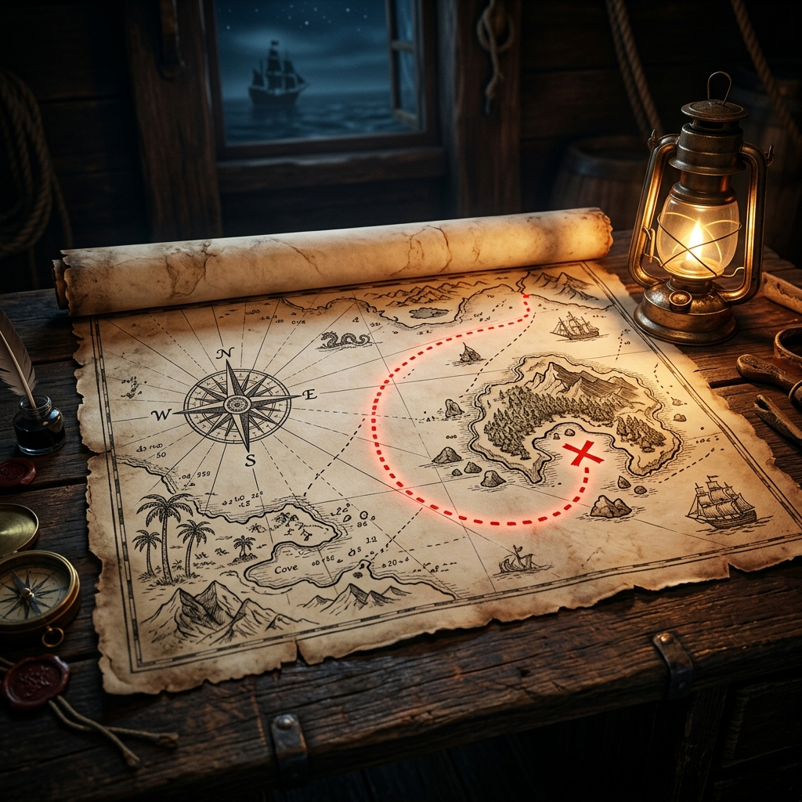

<div align="center">
  <a href="https://xaviaerox.github.io/DailyHack/">
    
  </a>
</div>

<div align="center">
  <h1>⚓ La Crónica Atemporal — DailyHack</h1>
  <p>
    <strong>Una Bitácora Pirata interactiva impulsada por Scrollytelling</strong>
  </p>
  <p>
    <a href="https://xaviaerox.github.io/DailyHack/" target="_blank">
      
    </a>
  </p>
</div>

<p align="center">
  <a href="#-visión-del-proyecto">Visión</a> •
  <a href="#-el-botín-características">Características</a> •
  <a href="#%EF%B8%8F-ingeniería-naval-arquitectura">Arquitectura</a> •
  <a href="#-las-maderas-del-navío-stack">Stack</a> •
  <a href="#-cartografía-despliegue">Despliegue</a>
</p>

---

## 🗺️ Visión del Proyecto

**La Crónica Atemporal** ha soltado amarras para evolucionar de un simple registro de prácticas de ASIR a una **auténtica experiencia cartográfica inmersiva**. 

Basado en el patrón de interacción *Scrollytelling*, este proyecto transforma un aburrido Markdown en un antiguo pergamino interactivo. A medida que scrolleas, tomas el timón de un navío que traza su ruta por el vasto océano del conocimiento, deteniéndose en diferentes islas y archipiélagos que representan los hitos técnicos de la formación.

> [!TIP]
> **Autogestión Mágica:** Nadie quiere escribir código para añadir un post. El motor interno de DailyHack parsea el diario maestro en Markdown y autogenera las islas, las coordenadas y la ruta sin tocar un solo componente de React.

---

## 💎 El Botín (Características)

- **Scrollytelling Inmersivo:** Desplazamiento ultra-fluido y con inercia gracias a `Lenis`. El scroll es tu timón.
- **Topografía Dinámica:** Cada capítulo de aprendizaje genera una masa de tierra (isla SVG) aleatoria con sus propias líneas topográficas. Los "días" son pines del tesoro esparcidos por ella.
- **Navegación Fiel al Trazado:** Un sistema matemático lee las curvas de Bezier de la ruta y posiciona un rastreador en forma de barco, navegando pixel a pixel según avanzas en la lectura.
- **Microinteracciones Premium:** Tooltips estilo pergamino oscuro, físicas elásticas (*Spring Animations*), texturas multicapa y un fondo que reacciona sutilmente.
- **Biblioteca Subterránea:** Una vista secundaria tipo *Grid/Library* para cuando solo quieres buscar información dura y pura mediante filtros.

---

## 🏗️ Ingeniería Naval (Arquitectura)

La magia ocurre en la conjunción entre Matemáticas, SVG y Framer Motion:

1. **Cartografía Algorítmica:** Los registros se empaquetan en *Capítulos*. Se calcula una ruta en zig-zag (alternando coordenadas X) de babor a estribor.
2. **Pathfinding Dinámico:** Generamos un `<path>` SVG y extraemos su longitud total.
3. **Tracking en Vivo:** Con `useScroll` medimos el progreso y usamos `getPointAtLength()` para extraer la posición exacta `(x,y)` del barco pirata sobre la ruta.

---

## 🪵 Las Maderas del Navío (Stack)

Construido con tecnología moderna para resistir el paso del tiempo:

- **Casco:** React 19 + TypeScript + Vite.
- **Velas (Estilos):** Tailwind CSS v4.
- **Física (Animaciones):** Framer Motion.
- **Timón (Scroll):** Lenis.
- **Brujula (Iconos):** Lucide React.
- **Puerto Seguro:** GitHub Pages automático.

---

## 📜 Cartografía (Despliegue Local)

Si quieres hacer tu propio mapa pirata, súbete a bordo:

1. **Recluta a la tripulación (Dependencias):**
   ```bash
   npm install
   ```
2. **Iza las velas (Arranca el servidor):**
   ```bash
   npm run dev
   ```
3. **Dibuja el mapa:** Cualquier cambio en tu `DIARIO_APRENDIZAJE.md` se renderiza al instante.

> [!IMPORTANT]
> **Integración Continua (GitHub Pages)**
> Gracias al sistema de poleas automatizado (GitHub Actions), cada `git push` a la rama `main` lanza una build de producción directa a tu GitHub Pages. Solo asegúrate de commitear el `package-lock.json` junto a tus tesoros.

---

<div align="center">
  
  <p><em>"El conocimiento es un mar vasto, y nosotros somos los navíos trazando la historia."</em></p>
</div>
